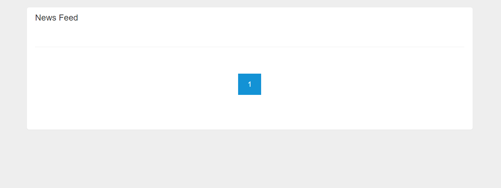
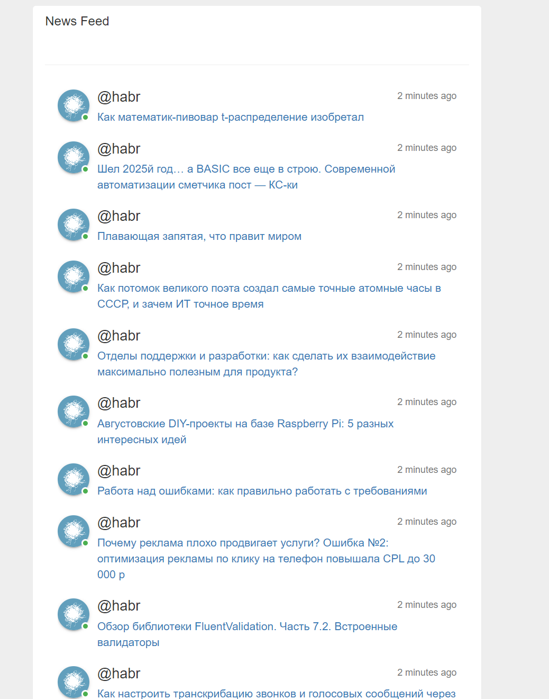

# Regex Query Tool

## Технологии:

- Используйте Django как основной веб-фреймворк
- Библиотеку [apscheduler](https://apscheduler.readthedocs.io/en/3.x/userguide.html) как планировщик фоновых задач (он
  понадобится для подтягивания данных с новостных лент)
- Так же может понадобится [feedparser](https://feedparser.readthedocs.io/en/latest/introduction.html) для
  парсинга [rss](https://ru.wikipedia.org/wiki/RSS) ленты новостных изданий
- Простой фронтенд, использование только HTML будет достаточно


##  Примеры реализации:

- Яндекс.Дзен


> Основная работа будет происходить не в Django, а с apscheduler,
> который будет в фоновом режиме раз, допустим, в 5 минут подтягивать новости из rss фида и сохранять его к вам в бд

## Эндпоинты:

- Главная и единственная страница, **path**:  - <your_domain>/



<sup>Новостная лента без записей</sup>


<sup>Новостная лента c записями</sup>

Каждая запись содержит: 
- Новостной источник
- Заголовок новости
- Ссылку на изначальный новостной источник. В данном случае заголовок новости кликабельный и ведет на пост на хабре (используйте html тэг a с аргументом [href](https://www.w3schools.com/tags/att_a_href.asp) для этого)
- Дата появления записи (в примере используется функция naturaltime из библиотеки [humanize](https://pypi.org/project/humanize/)

<sup>В примере используется новостная лента [Хабра](https://habr.com/ru/rss/articles/)</sup>

## Работа с apscheduler:
Вам нужно будет написать планировщик задач, которой будет подтягивает rss фид в фоновом режиме в Вашу БД

- Если будете писать на чистом apscheduler, то Вам может понадобится такая конструкция, 
она позволяет работать с моделями и orm django без помощи manage.py (Важно сначало вызвать ```django.setup()``` и только потом испортировать Ваши модели))
```python
import os
import sys
import django

sys.path.append(os.path.dirname(os.path.dirname(os.path.abspath(__file__))))
os.environ.setdefault('DJANGO_SETTINGS_MODULE', 'your_project.settings')
django.setup()

from app.models import model
```
- apscheduler предоставляет разные виды планировщиков, проще всего будет использовать BlockingScheduler и запускать его в отдельном от django процессе
- Так же можете воспользоваться [django-apscheduler](https://pypi.org/project/django-apscheduler/) - это небольшая обертка apscheduler, которая позволяет легковесно добавить ваши таски в БД и админку
##

*Задание под звездочкой:
[Создать](https://dracodes.hashnode.dev/how-to-create-a-custom-managepy-command-in-django) отдельную команду для manage.py, которая будет запускать Ваш планировщик*
